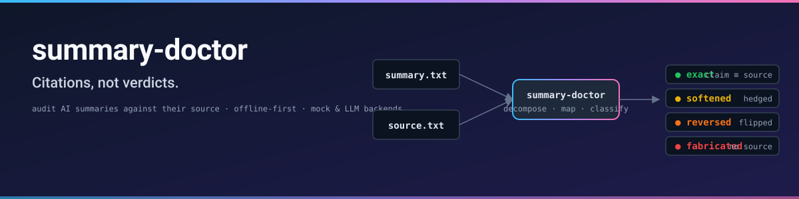

# summary-doctor

> **Your AI summary may be lying. This catches the reversals, fabrications, and cherry-picking — with citations, not verdicts.**

English | [简体中文](README.zh-CN.md)

[](LICENSE)
[](https://www.python.org/)
[](docs/ROADMAP.md)
[](#contributing)

<p align="center">
  
</p>

> A 30-second demo GIF lands in v0.1.1 — until then the diagram above shows the pipeline.

LLM-generated summaries of public talks, interviews, and articles are now mass-distributed on social platforms. Anecdotal evidence and a growing literature on LLM faithfulness suggest that **a non-trivial fraction of claims in such summaries can diverge from the source material** — sometimes outright reversing the speaker's position.

There is currently no open tool that maps each claim in a summary back to the source and labels the faithfulness. **This project is that tool.**

```
┌──────────────────────────────────────────────────────────────┐
│  AI summary                source material                   │
│       │                          │                           │
│       └────────┬─────────────────┘                           │
│                ▼                                             │
│       summary-doctor  →  per-claim label + quoted citation   │
│                                                              │
│   exact · softened · reversed · fabricated                   │
└──────────────────────────────────────────────────────────────┘
```

---

## Why "citations, not verdicts"

We do **not** decide whether a summary is "true" or "false". The tool outputs a mapping with the matched source paragraph quoted verbatim, plus a 4-class label and a confidence. **The human reader makes the final call.**

This matters because:

1. LLM-auditing-LLM has same-origin bias. Outputting citations sidesteps the "who audits the auditor" problem.
2. `fabricated` may be a false positive when source retrieval is partial (paywall, OCR failure, chunked context). The reader sees the matched paragraph (or "no match") and decides.

See [`docs/SPEC.md`](docs/SPEC.md) for the full design rationale.

---

## Install

```bash
pip install -e .                  # core
pip install -e '.[anthropic]'     # with Anthropic SDK
```

Python 3.10+ required.

### Using your Claude Code subscription (no API key)

If you already pay for a Claude Code subscription, you can reuse that auth
and quota instead of getting an Anthropic API key. Make sure `claude
--version` works in your shell, then:

```bash
summary-doctor demos/01-reversal-en/summary.txt \
  --original demos/01-reversal-en/source.txt \
  --lang en \
  --backend claude-cli \
  --model haiku
```

This shells out to `claude -p` under the hood. Marginal cost per audit is
your existing subscription's normal usage — no separate API billing. Use
`--model opus` for higher accuracy on tricky reversed/softened boundaries.

---

## 30-second quickstart

```bash
# 1. dry-run with the bundled demo (no API key needed)
summary-doctor demos/01-reversal-en/summary.txt \
  --original demos/01-reversal-en/source.txt \
  --lang en --mock

# 2. real audit with Anthropic Claude
export ANTHROPIC_API_KEY=sk-ant-...
summary-doctor demos/01-reversal-en/summary.txt \
  --original demos/01-reversal-en/source.txt \
  --lang en
```

Output:

```
[ok] report: summary-audit-20260519-101103.md
[ok] json:   summary-audit-20260519-101103.md.json
[summary] 9 claims · divergence 72% · reversed 6 · fabricated 0
```

The markdown report shows, for each claim:

```markdown
### Claim 1 — `reversed` (confidence 75)

**Summary claim:**
> LLMs reduce radiologist workload.

**Matched source paragraph:**
> ...every LLM-drafted report added review and correction time that
> matched or exceeded the time saved on initial drafting. Total time
> per case therefore continued to grow...

**Rationale:** Polarity mismatch with strong keyword overlap (6/7).
```

---

## The 4 labels

| Label | Definition |
|-------|-----------|
| `exact` | Summary claim is supported almost verbatim by source. |
| `softened` | Summary preserves direction but loses qualifiers / strength. |
| **`reversed`** | Summary inverts or contradicts the source's position. |
| **`fabricated`** | Summary claim has no support anywhere in source. |

`reversed` and `fabricated` are the high-signal labels you want to act on.

---

## What it is not

- It is not a truth oracle. It is a **citation mapper**.
- It is not a real-time stream auditor.
- It is not a publisher / author reputation system. Different problem.

The `--mock` backend is a heuristic pipeline-tester, **not** a calibrated detector. Use the Anthropic backend for real audits. See [`docs/MOCK-LIMITS.md`](docs/MOCK-LIMITS.md).

---

## Mock vs Anthropic — when to use which?

| Use case | Backend | Why |
|---|---|---|
| CI smoke test | `mock` | no API key, deterministic |
| Personal quick check | `mock` | offline, free |
| Comparing summaries before sharing | `anthropic` Haiku 4.5 | cheap calibrated detection |
| Nuanced reversal / softened boundary | `anthropic` Opus 4.7 | best accuracy |
| Multi-language source | `anthropic` (any) | mock lacks cross-language alignment |

See [`docs/EVALUATION.md`](docs/EVALUATION.md) for how the two backends compare on the bundled demo set, and [`docs/PROMPT-ENGINEERING.md`](docs/PROMPT-ENGINEERING.md) for how the Anthropic prompts are designed.

---

## How it works (5-stage pipeline)

```
[1 input]  →  [2 extract]  →  [3 decompose]  →  [4 map+classify]  →  [5 report]
   ↓             ↓                ↓                  ↓                  ↓
 url/file    plain text       claim list         labeled pairs     md + json
```

Stages 3 and 4 call an LLM (Anthropic Claude by default). Stages 1, 2, 5 are deterministic. See [`docs/SPEC.md`](docs/SPEC.md) for full state machine, failure paths, and out-of-scope items.

---

## Demos

Three bundled cases live under [`demos/`](demos/). All demos are **synthetic** — any resemblance to specific real speakers, talks, or organizations is unintended.

| Demo | Language | Designed to surface |
|------|----------|---------------------|
| `01-reversal-en` | English | Reversed claims + fabricated claim (GPU supply red herring) |
| `02-softening-zh` | 中文 | Softened qualifiers + a reversed claim |
| `03-faithful-en` | English | Positive control — should produce mostly `exact` |
| `04-cherry-picking-en` | English | Cherry-picking — softened by dropping qualifiers |
| `05-causal-inversion-zh` | 中文 | Causal direction flipped (X → Y vs Y → X) |
| `06-scope-creep-en` | English | Scope creep — narrow finding stated as universal |
| `07-temporal-error-en` | English | Year / date fabricated outside source |
| `08-fabricated-stats-zh` | 中文 | Numeric statistics invented from thin air |
| `09-faithful-zh` | 中文 | Positive control — Chinese mirror of demo 3 |

---

## Roadmap

- v0.1 (this release): CLI, 5-stage pipeline, Claude backend, 3 demos.
- v0.2: Cross-language alignment, chunked sources, audio/video via ASR.
- v0.3: Chrome extension, Claude Code / Cursor Skill manifest, batch mode.

See [`docs/ROADMAP.md`](docs/ROADMAP.md).

---

## Self-audit (lands in v0.1.1)

To keep this project honest, CI will run `summary-doctor` against the repository's own README claims (`make self-audit`). Limits of self-audit are kept honest in [`docs/MOCK-LIMITS.md`](docs/MOCK-LIMITS.md).

---

## Contributing

The most useful contributions right now:

1. Public-domain demo cases in **other languages** (especially low-resource).
2. Failure-mode examples where the Anthropic backend produces `reversed` but the source actually supports the claim — these calibrate the prompts.
3. Browser extension prototypes for the v0.3 milestone.

PRs welcome. Please open an issue first for anything beyond a typo fix or new demo case.

---

## License

[MIT](LICENSE)
